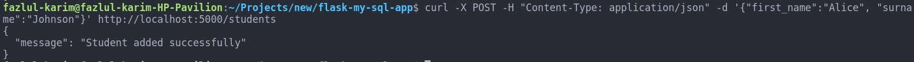
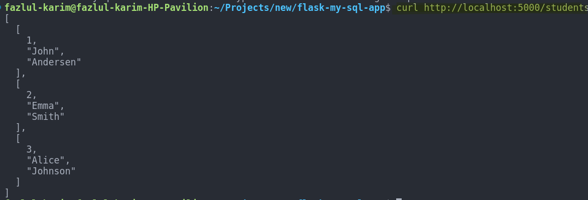

# Flask-MySQL Dockerized REST API Setup Guide


This project demonstrates a simple Flask application connected to a MySQL database. It allows adding and retrieving student data through HTTP requests.

## Project Structure

```
flask-mysql-app/
├── mysql/
│   ├── Dockerfile
│   ├── my.cnf
│   └── database_students.sql
├── python/
│   ├── Dockerfile
│   ├── app.py
│   └── requirements.txt
```

## MySQL Setup

 **Build and Run MySQL Container**: Build the MySQL image and run the container:

   ```bash
   docker build -t mysql-database ./mysql/
   docker run -d --name mysql -e MYSQL_ROOT_PASSWORD=root mysql-database
   ```

## Flask Application Setup

**Build and Run Flask Application Container**: Build the Flask image and run the container:

   ```bash
   docker build -t flask-mysql-app ./python/
   docker run -d --name myapp --link mysql:mysql -p 5000:5000 flask-mysql-app
   ```

## Test the Connection


### POST Method

```bash
curl -X POST -H "Content-Type: application/json" -d '{"first_name":"Alice", "surname":"Johnson"}' http://localhost:5000/students
```



### GET Method

```bash
curl http://localhost:5000/students
```

